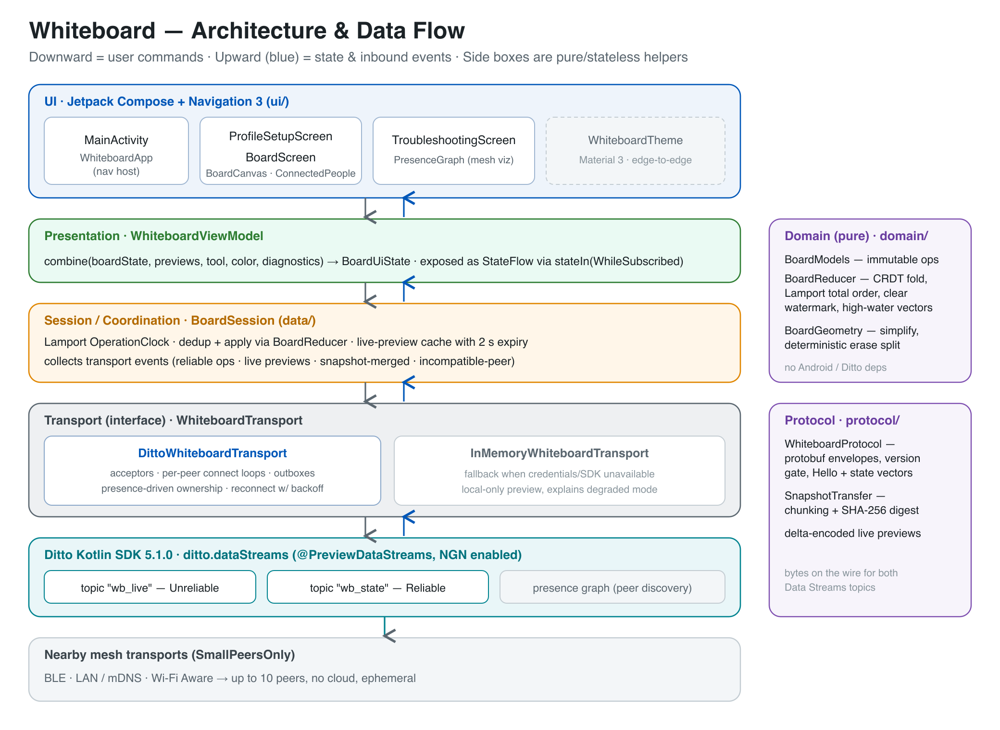
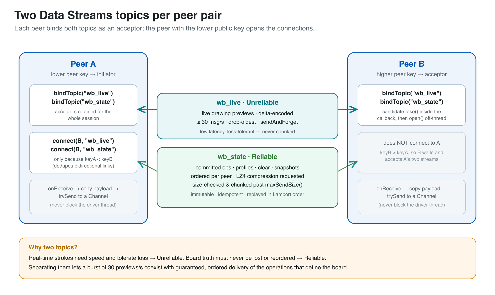
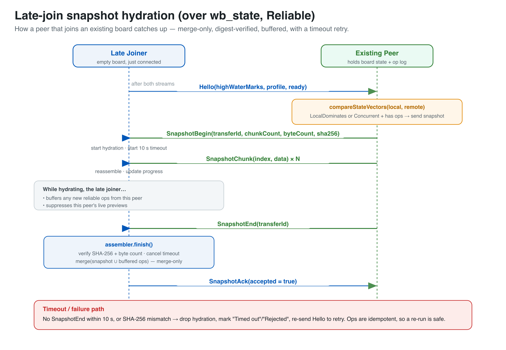

# Architecture & Data Streams walkthrough

This page explains how the Whiteboard app is put together and, specifically, **how it uses the Ditto Data Streams API**. If you're evaluating Data Streams, the two things worth understanding are (1) *why the app opens two separate streams* and (2) *how a peer that joins late catches up*. Both are diagrammed below.

> API reference: [`DittoDataStreams.md`](../DittoDataStreams.md) · usage guide: [`SKILL.md`](../SKILL.md)

---

## 1. Layers & data flow



The app is a one-directional stack. **User actions flow down**; **state and inbound network events flow up** (blue arrows). The domain and protocol modules on the right are pure/stateless helpers with no Android or Ditto dependencies, so they can be unit-tested in isolation.

| Layer | Package | Responsibility |
|---|---|---|
| **UI** | `ui/` | Jetpack Compose + Navigation 3. Draws the board, the connected-people roster, and a live presence-graph troubleshooting view. Renders state and forwards pointer events — no business logic. |
| **Presentation** | `ui/WhiteboardViewModel` | `combine`s board state, live previews, the selected tool/color, and diagnostics into a single immutable `BoardUiState`, exposed as a lifecycle-aware `StateFlow`. |
| **Session / coordination** | `data/BoardSession` | The heart of the app. Assigns Lamport-ordered stamps to local operations, de-duplicates and folds operations through `BoardReducer`, keeps a short-lived live-preview cache, and collects inbound transport events. |
| **Transport (interface)** | `transport/WhiteboardTransport` | The seam between the app and the network. `DittoWhiteboardTransport` is the real implementation; `InMemoryWhiteboardTransport` is a graceful fallback that runs as a local-only preview when credentials or the SDK are unavailable. |
| **Ditto SDK** | `ditto.dataStreams` | Two bound topics — `wb_live` (Unreliable) and `wb_state` (Reliable) — plus the presence graph used to discover peer keys. NGN is enabled in `WhiteboardApplication.onCreate()` before Ditto is constructed. |
| **Mesh** | — | `SmallPeersOnly` nearby transports (BLE, LAN/mDNS, Wi-Fi Aware). Up to ten peers, no cloud, ephemeral — nothing is written to the Ditto store. |

**Domain** (`domain/`) holds the immutable operation model and `BoardReducer`, a CRDT-style fold that produces board state from the operation log in Lamport total order, honouring a "clear" watermark and per-peer high-water vectors. **Protocol** (`protocol/`) turns operations into protobuf envelopes on the wire, gates incompatible protocol versions, and implements chunked, SHA-256-verified snapshot transfer.

---

## 2. Two Data Streams topics per peer pair



Every peer **binds both topics as an acceptor** and retains those acceptors for the whole session. To avoid opening a stream in both directions, the app uses a simple tie-break: **the peer with the lower public key calls `connect()`**; the higher-key peer only accepts. On the receiving side the candidate is claimed with `take()` inside the bind callback and opened on a background dispatcher, and every `onReceive` callback does nothing but copy the payload and `trySend` it onto a channel — the SDK's driver thread is never blocked.

| Topic | Reliability | Carries | Delivery characteristics |
|---|---|---|---|
| **`wb_live`** | Unreliable | Live drawing previews (delta-encoded) | ≤ 30 msg/s, drop-oldest, `sendAndForget`, never chunked — optimised for latency, tolerant of loss |
| **`wb_state`** | Reliable | Committed operations, profiles, clears, snapshots | Ordered per peer, LZ4 compression requested, size-checked and chunked past `maxSendSize()`; operations are immutable, idempotent, and replayed in Lamport order |

**Why split them?** Real-time strokes need to be fast and can tolerate a dropped frame, so they go over an Unreliable stream. The operations that *define the board* must never be lost or reordered, so they go over a Reliable stream. Running them as separate topics lets a burst of previews coexist with guaranteed, ordered delivery of the board's source of truth.

---

## 3. Late-join snapshot hydration



When a peer joins a board that already has content, it can't replay history it never saw — so an existing peer sends it a **snapshot** over the Reliable stream:

1. Once both streams are open, the late joiner sends a **`Hello`** carrying its per-peer high-water marks, its profile, and a `ready` flag.
2. The existing peer runs `compareStateVectors`. If it has operations the joiner is missing (`LocalDominates`, or `Concurrent` with local ops), it begins a snapshot.
3. **`SnapshotBegin`** announces the transfer id, chunk count, byte count, and SHA-256 digest; the joiner starts hydrating and arms a 10-second timeout.
4. **`SnapshotChunk × N`** stream the compressed board state; the joiner reassembles and reports progress.
5. While hydrating, the joiner **buffers** any new reliable operations from that peer and **suppresses** its live previews, so nothing is applied out of order.
6. **`SnapshotEnd`** closes the transfer. The joiner verifies the SHA-256 digest and byte count, then does a **merge-only** apply of the snapshot together with the buffered operations.
7. The joiner replies with **`SnapshotAck(accepted = true)`**.

If `SnapshotEnd` doesn't arrive within 10 seconds, or the digest doesn't match, the joiner drops the hydration, marks it timed-out/rejected, and re-sends `Hello` to try again. Because operations are idempotent, re-running the exchange is safe.

---

## Regenerating the diagrams

The diagrams are authored as SVG in [`diagrams/`](diagrams/) and rendered to PNG (GitHub renders PNG reliably in Markdown):

```bash
cd docs/diagrams
for f in architecture data-streams-topology snapshot-sequence; do
  rsvg-convert -z 2 "$f.svg" -o "$f.png"
done
```
